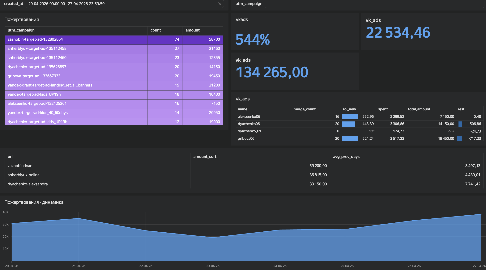

# charity-market-analysis
Сквозная аналитика рекламы для некоммерческой организации

На скриншоте представлен дашборд, объединяющий маркетинговые расходы и фактические поступления средств.
Настроила сквозную аналитику пожертвований, объединив данные рекламных кабинетов (ВК) и внутренние данные о фактических платежах. Главная цель — рассчитать ROMI (окупаемость маркетинговых инвестиций).
